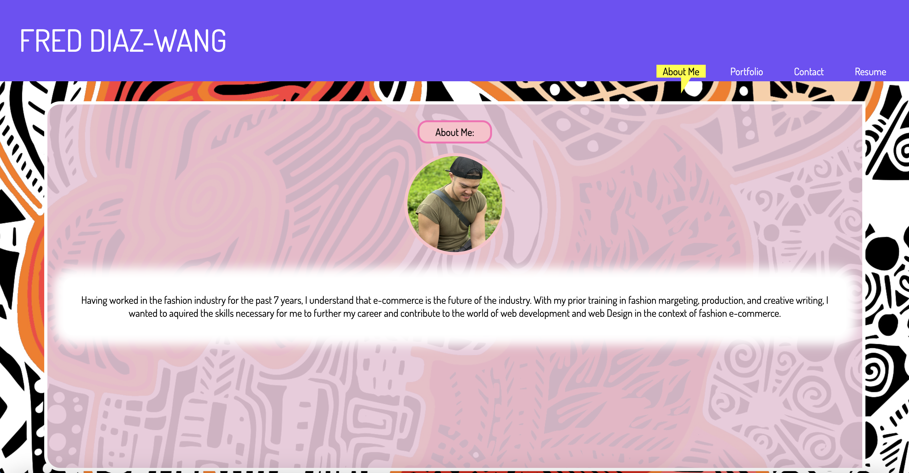
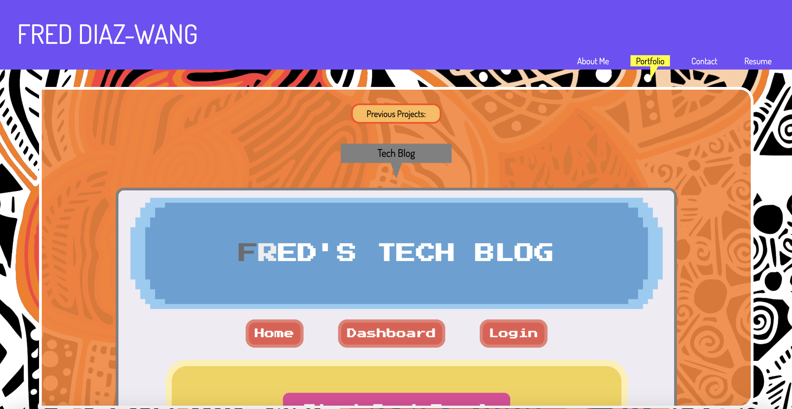
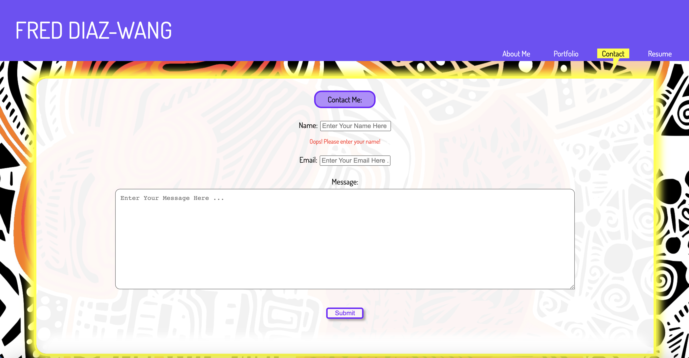
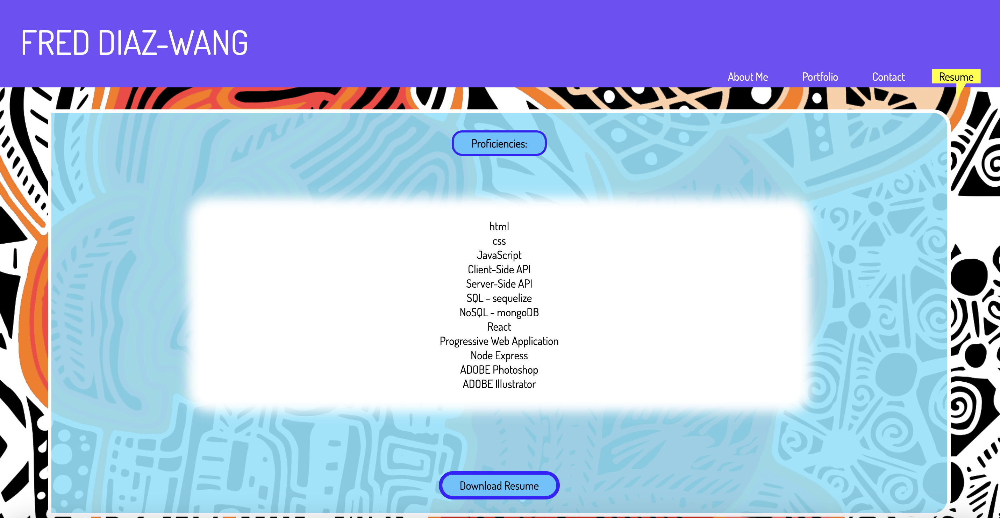
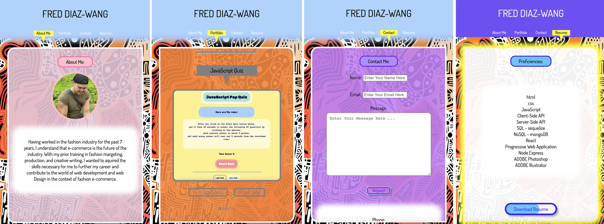

# Portfolio Build with React 

  ## <a id="Description">Description</a> 

  This is my updated responsive portfolio built with React - with playful colors, cute animations, and hover effects!
  
  Upon page load you will be greeted with the "about me" section, which includes a picture and a brief introduction of myself. The header includes four tabs: "about me", "portfolio", "contact", and "resume". The tab that's currently on display is highlighted with a chat bubble. 

  The portfolio section is a list of six of my best previous projects, each with a project title, a project screenshot, a link to the deployed project, and a link to the project's repo on GitHub. As you reach the end of the list, you'll be presented with a link that will take you smoothly back to the top of the list. 

  The contact section includes a contact form for users to send me a message, as well as see my contact info (phone and email). Users will be prompted to enter their name, email, and a message, all of which are required fields. If they click away from a field without entering anything or if they enter an invalid email, they will be notified that all three fields are required or that the email they entered is invalid. If they did not finish entering all three required fields before clicking on the submit button at the bottom of the form, they will be alerted that they need to do so before submitting the contact form. Upon successful form submission, users will be presented with a pop-up modal that thanks them for submitting the message, before the app reloads and takes the users back to the "about me" page.

  The resume section includes a list of my web development proficiencies, as well as a link that allows the user to download my resume. 

  The footer consists of the link to my gitHub profile, where all my repos are listed, as well as links to three of my other social media accounts (LinkedIn, Instagram, and Facebook).

  URL of the deployed portfolio on GitHub Pages: https://feddericowayne.github.io/React-Portfolio/
 
  URL of the GitHub repo: https://github.com/FeddericoWayne/React-Portfolio

  About Me page screenshot:
  

  Portfolio page screenshot:
  

  Contact page screenshot:
  

  Resume page screenshot:
  

  Mobile viewport screenshot:
  

***

  ## Table of Content

  ### [Description](#Description)
  ### [Installation](#Installation)
  ### [Usage](#Usage)
  ### [License](#License)
  ### [Contributing](#Contributing)
  ### [Tests](#Tests)
  ### [Questions](#Questions)

***

  ## <a id="Installation">Installation</a>

  No installation needed. This is a porfolio app that showcases my web deb capabilities.
  

***

  ## <a id="Usage">Usage</a>

  Use this app to get to know me as a full stack developer and to send me a message.

***

  ## <a id="License">License</a>
  
  This App is covered under the MIT license.

  
***

  ## <a id="Contributing">Contributing</a>

  Please refer to the Question section of this README for my contact information if you'd like to contribute to the development of this portfolio!

***

  ## <a id="Tests">Tests</a>

  N/A
  

***

  ## <a id="Questions">Questions</a>

  For more info on my work, please check out my GitHub page at: https://github.com/feddericowayne
  
  Should you have any further questions regarding this App, please don't hesitate to reach out to me via email at: <a href="mailto:jackiew1120@hotmail.com">jackiew1120@hotmail.com</a>

  
